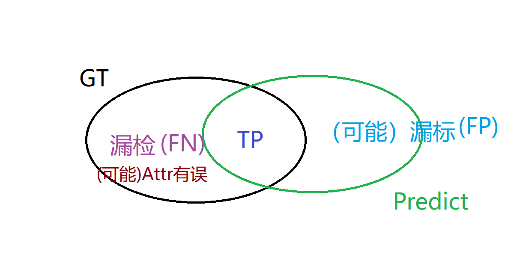

# 0709-0714 周报

Refine GT tool -> Refine GT according to predict

0709-0712 大体完成了对 GT 标注进行修正的功能及 UI
0713- 根据 predict 的结果来有选择的进行 refine，以及对应的 UI

## Refine GT tool

整个工具在这一周发生了不小的改变：

* labelme 源码的改动

从一开始尽力不更改 labelme 源码到向后兼容的修改（数据中多了 custom_data 以及 flags.verified 字段），目前的数据格式仍旧是可以在 plain 的 labelme 上查看编辑的，希望接下来的功能添加仍能做到这一点。

* interface 方法

Python 的 duck 类型使得我们仅需实现 interface 类中相同方法而无须真正的继承便能达到预期的效果。我们把所有的 custom 处理都在 interface 的实现中进行，这样便不会在 labelme 中添加过多的代码，仅对 custom_data 字段的修改也保证了向后兼容的实现。

* GUI

做 GUI 编程多少是有些欠缺经验的，从最一开始巨丑的 Tkinter 到目前在 labelme QT 基础上修改，至少是变得容易接受了。把功能集中到一起也减少了使用者的负担，目前仍有批处理的操作需要在命令行中完成，有待商榷。

## Refine GT according to predict

仅仅是能标注/refine 数据可能还是不太够的，最一开始虎哥也是说希望能有 GT 以及 predict 的结果来有选择地修正 GT 标注，昨天（0712）也和 weiqiang 确认了这一点。

目前需要把模型训练后存储的数据转化成能够进行标注的格式，在训练时丢掉了一些数据（如 label ID），也增添了一些数据（如 GT 的预测结果以及 predict 中新出现的框），参见下图：

具体的分析见 0712 日报。

## NEXT WEEK

这个工具的开发比预计的时间要长了一些，多次版本迭代、GUI、数据格式转换以及多种逻辑的处理，整个工作量也比一开始时预计的大了不少。下周工作：

* 完成 Refine GT according to predict
* 确定一下较为长期的实习规划