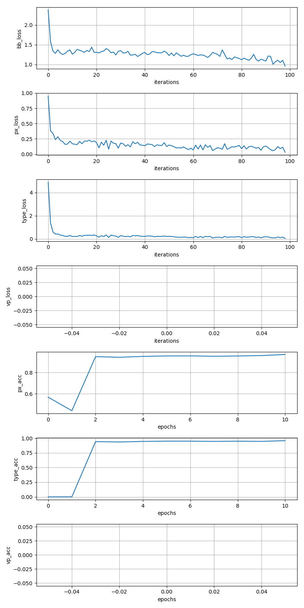

# 0730-0803 Weekly report

## Read papers:

VPGNet: Vanishing Point Guided Network for Lane and Road Marking Detection and Recognition, Seokju Lee, Junsik Kim, and other 8 people,  ICCV 2017

Detecting Vanishing Points using Global Image Context in a Non-Manhattan World, Menghua Zhai, Scott Workman, Nathan Jacobs, CVPR 2016

Horizon Lines in the Wild, Scott Workman, Menghua Zhai, Nathan Jacobs, BMVC 2016

Deep Learning for Vanishing Point Detection Using an Inverse Gnomonic Projection, Florian Kluger, Hanno Ackermann, Michael Ying Yang, Bodo Rosenhahn, GCPR 2017

## Setup Caffe on server

* Anaconda way, see [https://github.com/MiaoDX/system_configuration/blob/master/install_caffe.md](https://github.com/MiaoDX/system_configuration/blob/master/install_caffe.md)
* Still failed on python3.x (seems to be the caffe version of VPGNet)

## Reproduce VPGNet

* Run on Caltech lane

## TODO:

* VP and horizon line label tool
* Run the snapshot (trained model) on test data and visualize the result (may need code for lane clustering and segmentation)