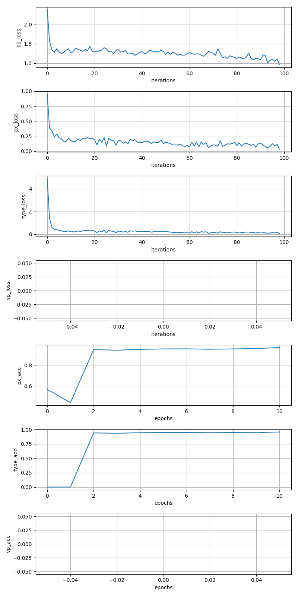

# 0802

DONE:

* First round job interview, just talk about the projects, no hard problems
* Presentation, VPGNet is temporary ready, others not

TODO:

* Other papers in the presentation
* Presentation and weekly report
* VP and horizon line label tool

# 0801

DONE:

* Install Caffe with python2.7
* Run the snapshot on test data

TODO:

* visualize the result
* prepare presentation
* JOB Interview ..

# 0731

DONE:

* Install caffe on server
    - [system_configuration/install_caffe.md](https://github.com/MiaoDX/system_configuration/blob/master/install_caffe.md)
    - The hard part is we can not install libraries via `apt-get` (which is the default option in many tutorials)
    - And there is some incompatible between `anaconda` libs and the system
    - When running, should make sure the lib is in the `LD_LIBARY_PATH` by ` export LD_LIBRARY_PATH=/home/users/dongxu.miao/py_env/py36_dl_caffe_self/lib:$LD_LIBARY_PATH`

* Run model VPGNet
    - Since there is no VP annotations, just use the demo case Caltech Lane dataset

    - The temporary result, Run on 1225 Caltech images, 200 as test
    
    

TODO:

* See results on the test set
* Finish paper Horizon Lines in the Wild
* Prepare presentation

# 0730

DONE:

* Read paper, Detecting Vanishing Points using Global Image Context in a Non-Manhattan World
    - This is one of the state-of-the art for VP detection (However, the output seems to be the horizon line instead of VP)
* Try to build VPGNet
    - It seems that the code is now completed, [the author update VP part of the algorithm](https://github.com/SeokjuLee/VPGNet/issues/24)
    - NOT finished (building)

TODO:

* Run the code of VPGNet on Caltech Lane dataset
* See paper [Horizon Lines in the Wild](https://github.com/scottworkman/deephorizon)
