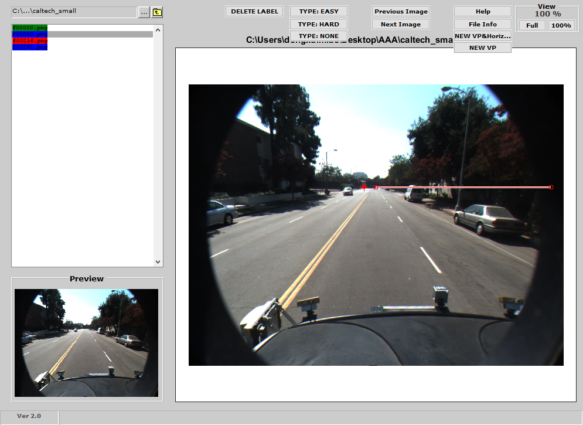

# 0806-0811 Weekly report

[http://gitlab.hobot.cc/dongxu.miao/VP_horizon_line_labeling_matlab](http://gitlab.hobot.cc/dongxu.miao/VP_horizon_line_labeling_matlab):

One VP(/horizon line) labeling tool based on [https://www.mathworks.com/matlabcentral/fileexchange/13000-imageviewer](https://www.mathworks.com/matlabcentral/fileexchange/13000-imageviewer), using Matlab.

* Preparation for the vanishing point/horizon line labeling tool
    - Use bare OpenCV maybe enough for the minimal requirements (point and line), but there is no support even for navigating the directory
    - One visually acceptable GUI is needed
    - The simpler, the better

* Choices
    - [pyqtgraph/pyqtgraph](https://github.com/pyqtgraph/pyqtgraph), this is one promising choice
    - Chat with yanhu, maybe Matlab is also possible

* Result

    - Label VP with `ginput`
    - Generate Horizon line with `imline`
    - Load/save label info into mat file
    - Navigation
    - Delete label
    - Specify label type
    - Multi VP and Horizon Lines

TODO:

* Post processing (python), convert label info into json files, ready for further processing
* Make one usable VP(/horizon line) dataset for auto driving
* Horizon lines in the wild, get familiar with caffe framework