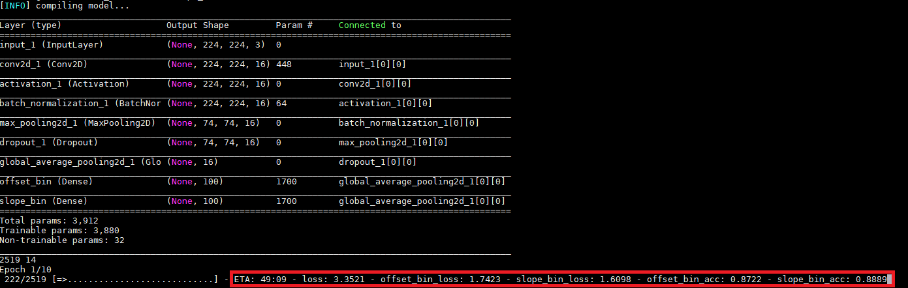
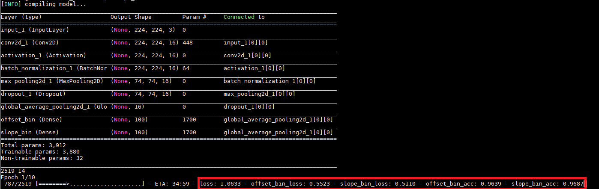
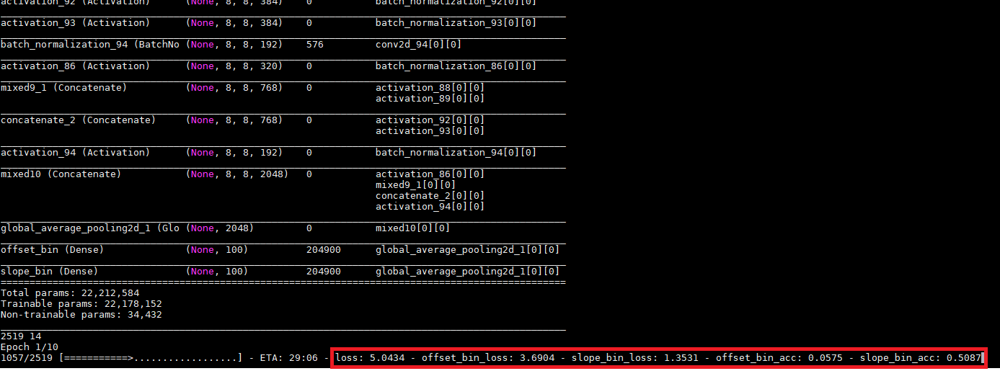
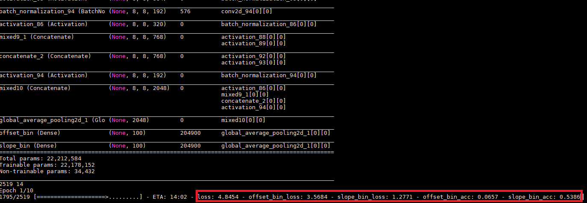
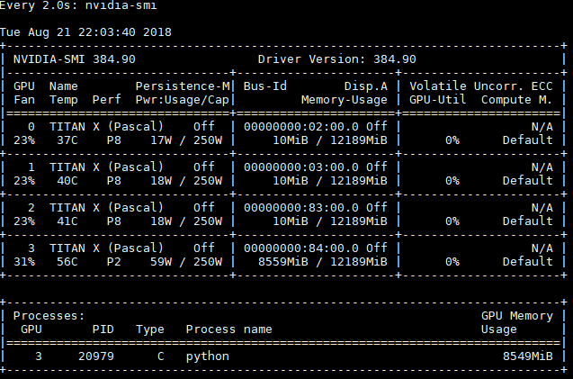

# 0825

DONE:
* Train network with config file
* Save used configuration file and weights and others to HDFS

TODO:
* See the results of long run (now 40 epochs)
* VP dataset

# 0823

DONE:
* Accelerate the data preprocess with joblib, now pretty neat
* Still `offset` not so good

CUES:
* The `preprocess_input` of VGG use `caffe` format, will not divide 255.0 (-1~1)
* Make the GT Y labels to be the same value, the network will converge, see picture 1 and 2
* And with `inception_v3` I got the reasonable result of `slope`, see picture 3 and 4
* So, there must be some problem with the parameterization OR we should just train more

# 0822

DONE:
* Network is running, but the `offset` loss just won't decrease
* And the network is slow, no matter what I do to it

TODO:
* Try regression loss
* Ask yanhu for some help
* Tweak the network

# 0821

DONE:

* One document for labeling VP and horizon line
* My network is runnable, at last

TODO:

It seems that my network is occupy the GPU memory but not actually use it...

# 0820

[http://gitlab.hobot.cc/dongxu.miao/deephorizon_reproduce/](http://gitlab.hobot.cc/dongxu.miao/deephorizon_reproduce/)

DONE:
* fit_generator with multi output
* Put network and data generator together
* Ready for training with images

TODO:
* Make the network run