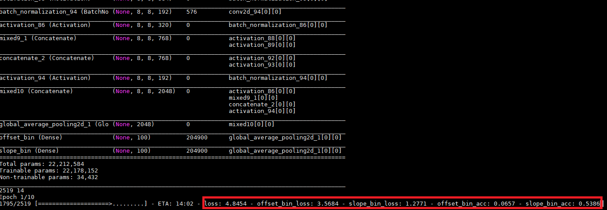

# 0820-0825 weekly report

Task 1. VP labeling document

Specify the labeling principles with example images.

Task 2. Reproduce HLW (Horizon lines in the wild)

[http://gitlab.hobot.cc/dongxu.miao/deephorizon_reproduce/](http://gitlab.hobot.cc/dongxu.miao/deephorizon_reproduce/)

* Multi output network on pre-trained model
* Customizable thread safe `fit_generator`
* Accelerate the data preprocessing with `joblib` library

PROBLEMS:
* Network is running, but the `offset` loss just won't decrease (or just too slow)

CUES:

* The `preprocess_input` of VGG use `caffe` format, will not divide 255.0 (-1~1) directly. (Maybe there are some other tricks?)
* Make the GT Y labels to be the same value, the network will converge, see picture 1 and 2
* And with `inception_v3` I got the reasonable result of `slope`, see picture 3 and 4
* So, there must be some problem with the parameterization OR we should just train more

For 100 classes:
The initial loss, with random guess, is -1.0*ln(0.01)=ln(100)=4.6
with acc 0.5 is -1.0*ln(0.5)=0.693
with acc 0.7 is -1.0*ln(0.7)=0.356

TODO:
* Make the network actually run
* Vanishing point and horizon lines dataset ...