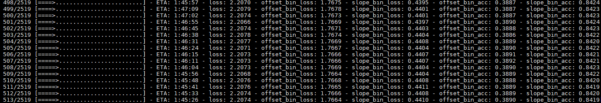

# 0830

* Label about 500 images
* Find one bug in previous implement, I chosen to center crop the whole image, but the parameterization did not check whether the hight is really always smaller than width, thus many (3/10) may have wrong offset label.
* Change learning rate very epoch by factor 0.2 to see whether the lr matters much

# 0829

* Label about 500 images

TODO:
* Use [https://github.com/aleju/imgaug](https://github.com/aleju/imgaug) to do image augmentation, its ability to simultaneously transform landmarks/keypoints seems suited for the horizon line (with only two points), we can do data prepreocessing more preciously.

# 0828

* Label almost 1000 images -.-
* The network seems working, see image 1

# 0827

DONE:
* Label 250 images for VP and horizon line detection
* Bug fix for deephorizon reproduce code

TODO:
* More images
* Visualization of network input and output