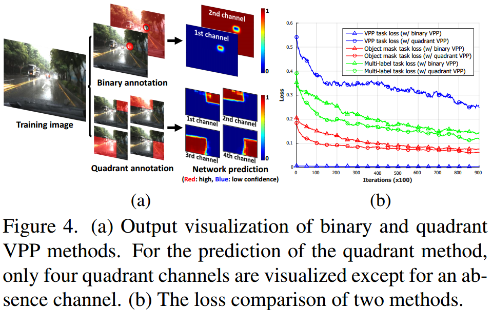

# 0827-0831 weekly report

## TASK 1: VP and horizon line labeling

* Label around 3256/6400 images
* type_key      NUM
  'EASY'        1106
  'HARD'        470
  'NONE'        274
  'OCCUPIED'    860
  'SIDEVIEW'    546

## TASK 2: Horizon Lines in the Wild

* Line parameterization bug:
    - the offset is divided by image height by some factor
    - I center crop the whole image
    - Forget to consider there can be height larger than width 28704/100553
* The training phase seems promising

* The validation is not that satisfying

TODO:

* Visualize the results
* Change lr with respect to epochs

## DISCUSSION: Parameterization of VP in driving scenario

* Horizontally flip of upper side should have no/little difference, so quadrant maybe insufficient.
* Introduce ellipse field
* Other choices?