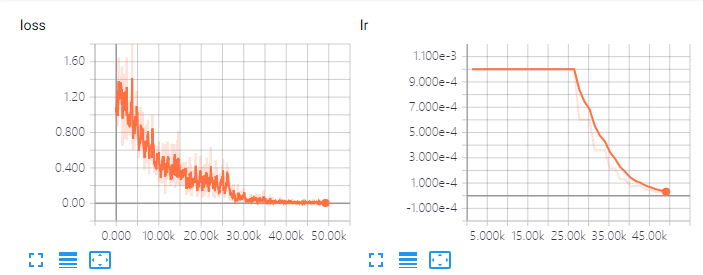
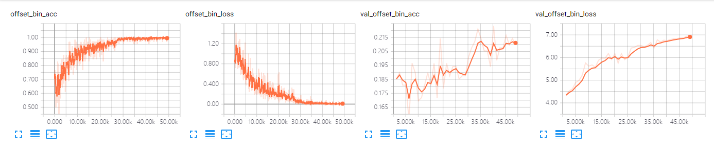
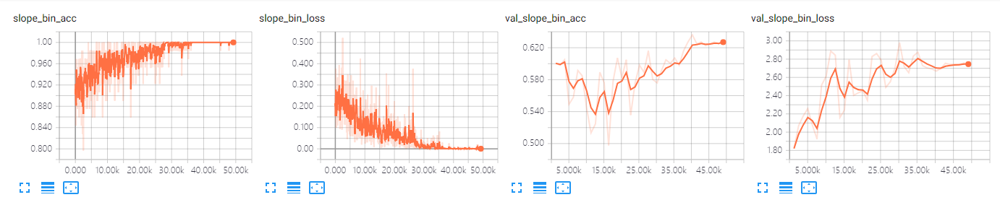

# 0903-0908 weekly report

# Task 1, Label VP dataset

# Task 2, Horizon Lines in the Wild

The train seems nice:

It seems that, it is overfitting.

# DISSCUSS

* Use `predict_generator` to get all the predict results for different epochs
    - The last epoch seems wrong, just not the same as predict one by one