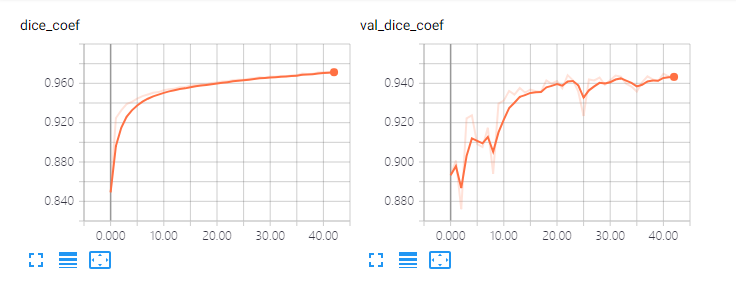

# 0910

Together with yesterday:

[http://gitlab.hobot.cc/dongxu.miao/vp_seg_unet](http://gitlab.hobot.cc/dongxu.miao/vp_seg_unet)

* Generate mask images as shown below

* Split train(0.8)/test(0.2) from `EASY` and `OCCUPIED` type
* Managed to run one UNet model on the VP, change code from [https://github.com/tkwoo/visualization-segmentation-process](https://github.com/tkwoo/visualization-segmentation-process)
* Re-run with validation and plotting with tensorboard

Some results:

Seems nice:

Some video demos:

Two train images:

Two test:

