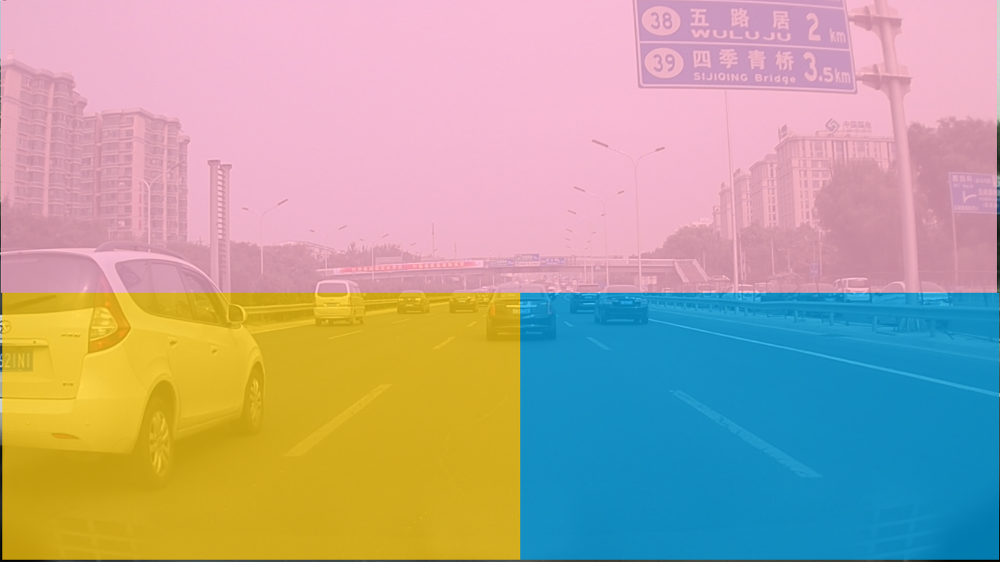

# 0911

After 50 epochs, I use the saved weights and test one no related video (not seen in the train/test dataset, even the color is slightly different). The results as shown below is impressive (to me), weiqiang said maybe should try regression first and establish one baseline.

TODO:
* Let the model train more time and see whether the performance will gain at some of the hard scenarios in the video
* Change for different training mechanism

# 0910

Together with yesterday:

[http://gitlab.hobot.cc/dongxu.miao/vp_seg_unet](http://gitlab.hobot.cc/dongxu.miao/vp_seg_unet)

* Generate mask images as shown below

* Split train(0.8)/test(0.2) from `EASY` and `OCCUPIED` type
* Managed to run one UNet model on the VP, change code from [https://github.com/tkwoo/visualization-segmentation-process](https://github.com/tkwoo/visualization-segmentation-process)
* Re-run with validation and plotting with tensorboard

Some results:

Seems nice:

Some video demos:

Two train images:

Two test:

