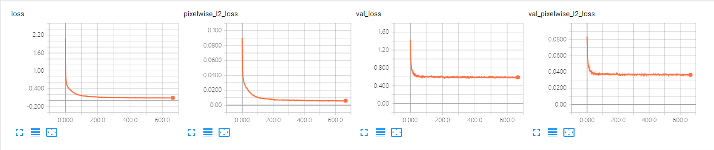
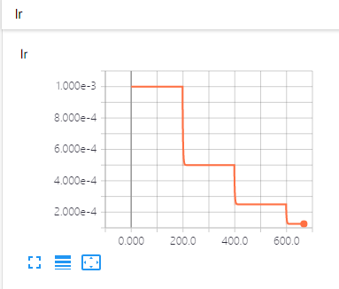
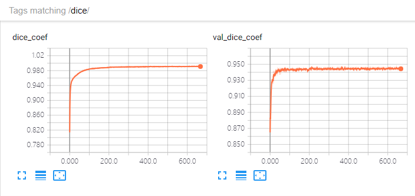

# 0910-0914 weekly report

Task: Establish one baseline for Vanishing Point detection

[http://gitlab.hobot.cc/dongxu.miao/vp_seg_unet](http://gitlab.hobot.cc/dongxu.miao/vp_seg_unet)

* Use segmentation as the parameterization method
* UNet with NClass*Layers output feature map, each one is binary classification of the pixel WRT one type
* Resize the image to (almost) half to have suitable training speed

Some visual results:

* The training seems already at one optimum, the train and val seems no big difference: The training is effective; the distribution of the train/val split is too similar.

* Some video demo showing the method is workable (50/250/550/650 epochs)

TODO:

* Regress the VP position directly as one baseline
* Try parameterization 3 as shown before (one hole near at the VP)
* Run the model on Cloud with more computation power

QUSTION/HELP WANTED:

* Data augmentation/custom data generator
    - Only need one pixel position (x, y) as label
    - Speed of customize dataloader