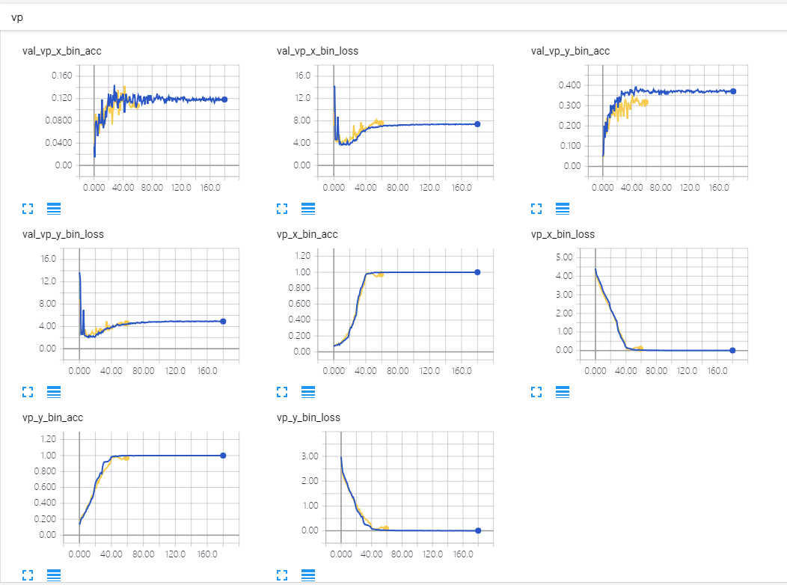

# 0921

Some experiments on VP detection

* Regression
    - Use image center as origin, make sure the data is uniform
    - `Hole` as in densebox
* Classification
    - See the training result

* Try SGD/different learning rate

* Use `Sequence` for data generator, I missed it before

# 0918

* Digest the possibility of using classification bins to do the VP detection

There are two runs, seems no big difference, it seems that validation loss will increase after some epochs, not so sure why.

Will see the plot tomorrow and evaluate the inference result and see some predict images to digest the situation.
