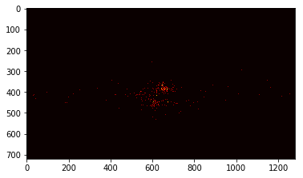
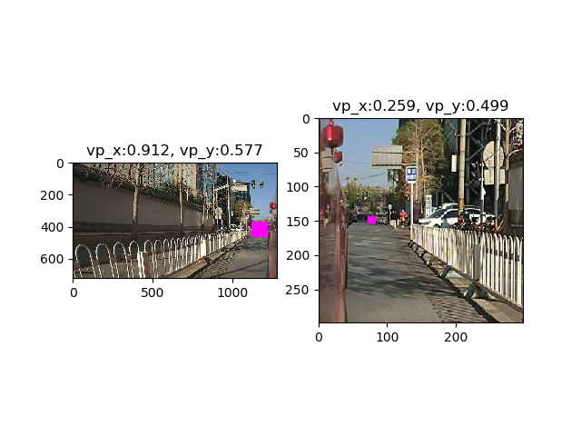
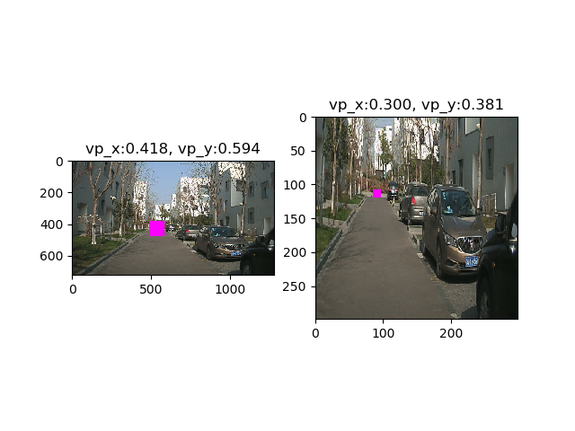
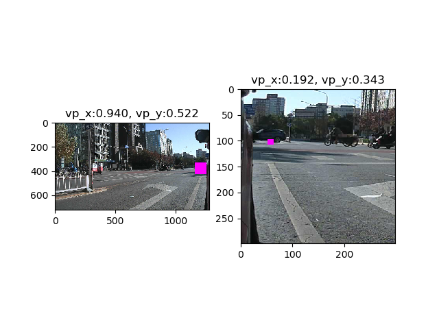
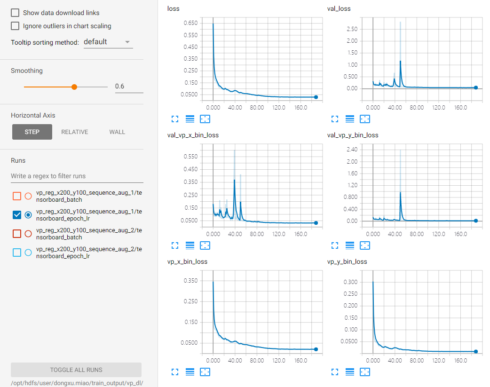
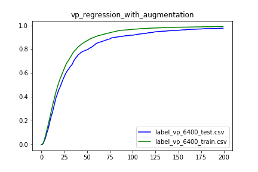
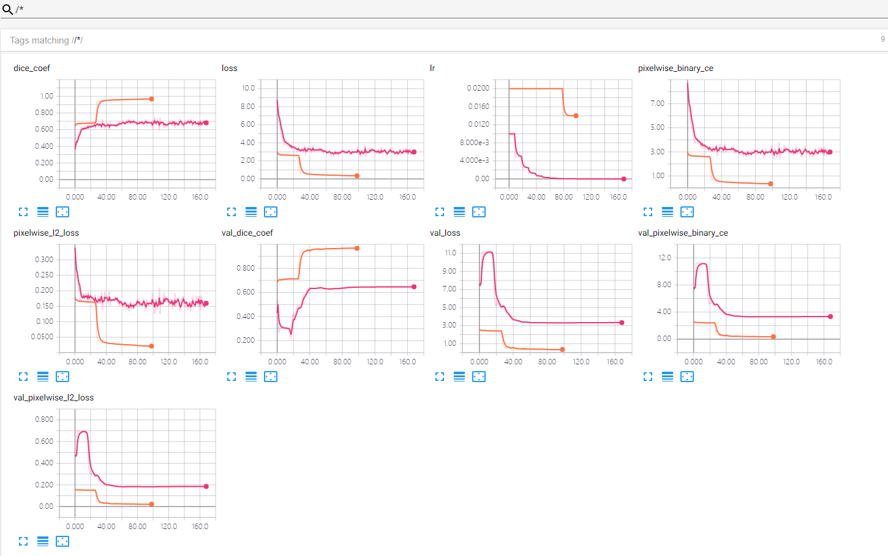

# 0925-0930 weekly report

# VP detection via regression

[http://gitlab.hobot.cc/dongxu.miao/deephorizon_reproduce.git](http://gitlab.hobot.cc/dongxu.miao/deephorizon_reproduce.git)

* Regress the position of VP directly

Since the distribution of our VP do has some bias (at the image center), as shown below, after training, the model just tried to predict VP as the center of image.



* Data augmentation

We use [https://github.com/aleju/imgaug](https://github.com/aleju/imgaug) for data augmentation. Since we want to keep the VP still in image after the augmentation, the crop should be designed accordingly. And the ability to do same transformation on key point (VP in our case) and images with ease makes this tool suitable for our choice.

Specifically, with known VP position, calc the ratio (x and y), extend 0.3 in each direction (and make sure not out of range, thus will have nearly 0.6 area). Crop the outer area randomly. And do other operations like Flip, GaussianBlue and Scale at the same time.

One simple augmentation example: 

``` vi
image_name,width,height,vp_x,vp_y,TYPE
19700101_080739_389_4.jpg,1280,720,387.758,435.64,EASY
```

Ratio: x_ratio, y_ratio = 387.758/1280, 435.64/720 = 0.30, 0.65

Extend region: x->[0, 0.6], y->[0.35, 0.95]

Crop: crop top, right, down, left by keeping x and y region

There are some examples:





* Train with data augmentation

The plot seems attractive:



And with some statistic analysis `Deviation-Percent-Curve`:



It seems that, with 50 pixels tolerance (WRT 1280*740), aka, 50/1478=0.034, we can have nearly 80% chance to locate the VP right. Anyway, not bad.

And with one unsee video to show the network actually learns something:


We extract low right part of the video to demonstrate the network can actually find the VP. However, it seems that the VP in low-right video always has higher Y value, chances are that the validation dataset has this limitation (we did not augment validation dataset at training stage).


* Train with data augmentation on validation dataset

It may seems not so ideal to do augmentation on val, but it can be useful, and to make the validation more steady, we enlarge the validation-steps to be 5x larger.


# VP detection via segmentation

[http://gitlab.hobot.cc/dongxu.miao/vp_seg_unet](http://gitlab.hobot.cc/dongxu.miao/vp_seg_unet)

It is highly important to choose a proper learning rate and corresponding decay:



And as before, the segmentation methods seems okay:


But the need to do post-processing makes segmentation method less attractive.