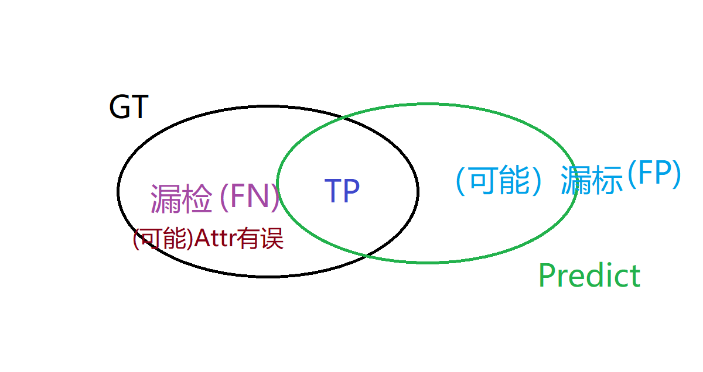

# 校招提前批面试 -- 实习总结文档或其他项目成果

在地平线实习正好一月，此时进行提前批面试准备也是一个阶段总结。在这一个月内参与了对内项目开发，也进行了一小段时间的预研任务，目前是负责对外项目的一部分。算是各个工作模块均有所涉猎，虽并未有很可观的产出，但对整个工作氛围、工作内容有了初步的认识。客观地讲，相对于正式员工们有明确的任务时间节点，实习期间压力还是比较小的，由于通勤时间的存在，比起在实验室的工作强度也是相差不少。所以效率便显得十分重要，另外，身边诸位小伙伴对自己还是有很大的冲击的。不少同学是在此实习进行过渡，秋季开学便进行深造或赴外游学，另有默默无闻但是简历骇人的同学，几乎所有人都异常谦虚，当然稍有过度的互相吹捧还是不那么好的 -.-

下面介绍一下本月的工作，因为是与编程、项目或科研相关，便以英文书写，略去转译的麻烦。

## Refine Label Tool (1-3 weeks)

[http://gitlab.hobot.cc/dongxu.miao/refine_label_GT](http://gitlab.hobot.cc/dongxu.miao/refine_label_GT)

[http://gitlab.hobot.cc/dongxu.miao/labelme_RefineLabel](http://gitlab.hobot.cc/dongxu.miao/labelme_RefineLabel)

In the first three weeks, we built one tool named **Refine Label Tool**. With the great success of Machine/Deep learning methods on perception tasks, the pursuit of data amount and quality is endless. However, with the manually labeled result as GT (ground truth), even with double/triple check, it will still has room for improvement.

This tool is used for refining existing GT labels with the help of trained models' predict result.

* Input: Predict results, (merged) GT file, the path of image folders
* Pipeline:
    - Split GT file to standalone json file for each image (custom file)
    - Extend custom file with predict results, add bboxes from predict, specify the type of each bbox
    - Manually refining with the changed labelme software
    - Filter the bboxes (save GT and new added one) and formating
    - Save back
* Output: changed GT files

## Research work

### 3D point cloud semantic segmentation

* PointSIFT: A SIFT-like Network Module for 3D Point Cloud Semantic Segmentation
* Superpoint Graphs, Large-scale Point Cloud Semantic Segmentation with Superpoint Graphs

### Vanishing point based(/and) lane detection

* VPGNet: Vanishing Point Guided Network for Lane and Road Marking Detection and Recognition
* DeepVP: Deep Learning for Vanishing Point Detection on 1 Million Street View Images