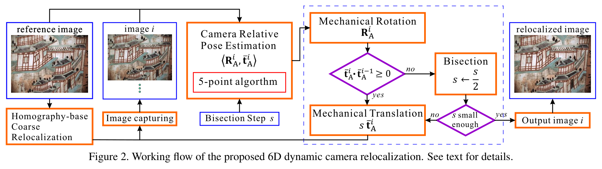
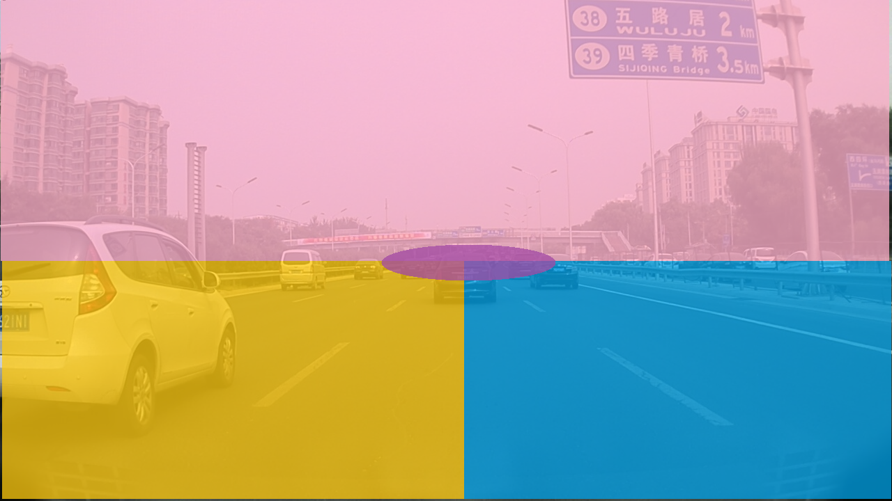

% Job Application for UISEE
% MiaoDX 缪东旭  MiaoDX@hotmail.com miaodx@tju.edu.cn
% Sep. 2018

<aside class="notes">
    https://github.com/hakimel/reveal.js/issues/2180#issuecomment-408520237
    
Go to "chrome://flags/". Disable "New Media Controls"
</aside>

***
# Outline
* Personal Information
* Two projects
    - School, Active Camera Relocalization (Finished)
    - Intern, Vanishing Point detection and application (Ongoing)
* Summary

***

缪东旭 miào

* Tianjin University, School of computer software
    - Low level computer vision
    - Robotics
* Xidian University, School of software
* Hobbies
    - Morning jogging
    - Cycling
    - Ancient poems/articles

***
## Experiences

* TJU RoboMaster Member
    - CV, DL methods on object detection, tracking and decision making.
* Teaching Assistant
    - Programming Design Practice I, full English course for freshmen.
* Teaching Python101
    - Teaching python for several overseas master candidates majoring in finance
* Volunteer Teacher
    - Volunteered to teach in one primary school in TongChuan, Shannxi, organized by “Dripping Action” (one project of Mutualistic Symbiosis community of Youths & Environment, Shaanxi).
* Perception algorithm engineer intern at Horizon Robotics
    - Traffic modeling
    - Labeling tool
    - Vanishing point based lane detection

***
## Technical Skills

{width=35%}

<aside class="notes">
Change to projects
</aside>

***
# Active Camera Relocalization

***
## What&Why

***
## 2D RGB images only

. . .

{width=95%}

. . .

6d dynamic camera relocalization from single reference image, Wei Feng, Fei-Peng Tian, Qian Zhang, and Jizhou Sun, CVPR 2016.

***
## Extension: RGBD camera

* Hand-eye calibration free.
* Faster ACR with depth information.
* Bounding strategy to restrict motion.
* Theoretically guaranteed convergence and feasible boundary condition.

***
{width=95%}

. . .

ACTIVE CAMERA RELOCALIZATION WITH RGBD CAMERA FROM A SINGLE 2D IMAGE, Dongxu Miao, Fei-Peng Tian, Wei Feng, ICASSP 2018

***

<!-- <video width="900" height="700"> -->
<video>
    <source src="acr_d_data/d_demo.mp4" type="video/mp4">
</video>

One Active Camera Relocalization process with ACRD method.

***

{width=95%}
{width=95%}

{width=95%}
{width=95%}

Two real-world scenes with ACRD.

***
## Quicker and more available?

{width=95%}

{width=100%}

Fast and Reliable Computational Rephotography on Mobile Device, Yi-Bo Shi, Fei-Peng Tian, Dongxu Miao, WeiFeng, ICME 2018

***

{width=95%}

{width=95%}

<aside class="notes">
    https://openmvg.readthedocs.io/en/latest/openMVG/multiview/multiview/
The homography matrix maps the relation between two projections of a plane
</aside>

***

<video width="640" height="480">
    <source src="acr_data/m_v_1.mp4" type="video/mp4">
</video>

One demo shows the key frames based method is more robust and accurate.

***

<video width="640" height="480">
    <source src="acr_data/m_v_2.mp4" type="video/mp4">
</video>

***

***
## Vanishing Point detection and applications

***
## What&Why

<aside class="notes">
matrix /'metrɪks/
</aside>

*** 
## VP Definition

A vanishing point is a point where parallel lines in a three-dimensional space converge to a two-dimensional plane by a graphical perspective. 

***

{width=95%}

{width=95%}

***
## VP in driving scenario

. . .

“Vanishing Point (VP)” is defined as the nearest point on the horizon where lanes converge and disappear predictively around the farthest point of the visible lane. -- VPGNet

VPGNet: Vanishing Point Guided Network for Lane and Road Marking Detection and Recognition, Seokju Lee, Junsik Kim, and other 8 people,  ICCV 2017

. . .

  
And, we also want to estimate the **pitch angle** through VP.

***
## Demo labeling

{width=90%}
{width=90%}

{width=90%}
{width=90%}

***

{width=95%}

{width=95%}

***
## VP labeling tool

{width=70%}

One VP(/horizon line) labeling tool based on [https://www.mathworks.com/matlabcentral/fileexchange/13000-imageviewer](https://www.mathworks.com/matlabcentral/fileexchange/13000-imageviewer), using Matlab.

***

* Label VP with `ginput`
* Generate Horizon line with `imline`
* Load/save label info into mat file
* Navigation
* Delete label
* Specify label type
* Multi VP and Horizon Lines

***
## One labeling demo video

<!-- <video width="640" height="480" controls> -->
<video width="640" height="480">
    <source src="vp_data_demo/vp_label_demo.mp4" type="video/mp4">
</video>

<!-- <video data-autoplay src="vp_data_demo/vp_label_demo.mp4"></video> -->

***
## Data statistics

{width=75%}

***
## Parameterization

***

{width=85%}

{width=95%}

***

{width=95%}

{width=95%}

***
## Model

{width=75%}
{width=80%}

***
## Result

. . .

<video data-autoplay width="300" height="300">
    <source src="vp_data_demo/predict_video_weights.0050.h5_0912_19_03.mp4" type="video/mp4">
</video>
<video data-autoplay width="300" height="300">
    <source src="vp_data_demo/predict_video_weights.0150.h5_0912_18_32.mp4" type="video/mp4">
</video>
<video data-autoplay width="300" height="300">
    <source src="vp_data_demo/predict_video_weights.0250.h5_0912_18_03.mp4" type="video/mp4">
</video>

One unseen video, with model training 50/150/250 epochs.

***
## Application

<video width="600" height="400">
    <source src="pics/drivable_area.mp4" type="video/mp4">
</video>

Traditional drivable area detection, with VP as oracle to correct predict.

***
## Push it further

* Multi tasks with lane/road marking detection
* Other loss functions, such as dice coefficient loss and maybe jaccard distance loss
* More training data, especially corner cases

***
# Summary

***
## Self-evaluation

***
{width=30%}
{width=30%}
{width=30%}

enough: $max(-x^2+1.5, -(x+1.5)^2-5.5)$  
target: $max(-x^2+3, -(x+1.5)^2)$  
my goal: $max(-(x-1.5)^2, -x^2+0.7, -(x+1.5)^2-0.7)$

<aside class="notes">
Personally, I am interested in autonomous driving area.

And what is more, I like to make friends and take different chances.

I personally like to join the party average ability better than me, because I have the confidence to be better than average.

me, max(-((x-1.5)*4)^2, -(x*4)^2+0.7, -((x+1.5)*4)^2-0.7) x->(-6,6) y->(-15,4)
target, max(-(x*4)^2+3, -((x+1.5)*4)^2)
enough, max(-(x*4)^2+1.5, -((x+1.5)*4)^2-5.5)

</aside>

***
# That is all, thanks!